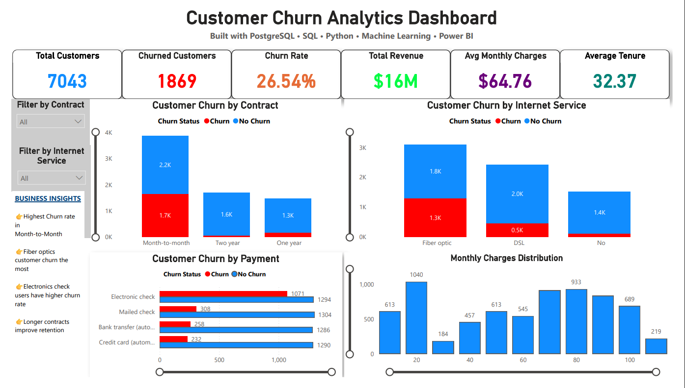
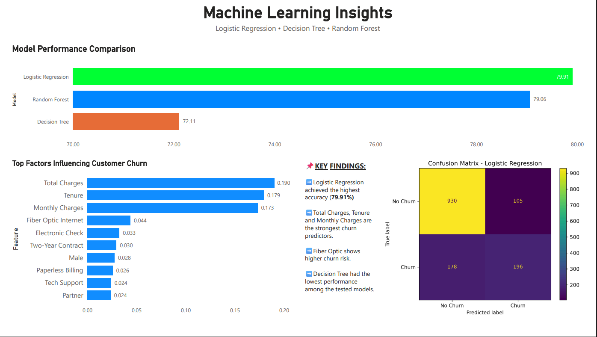

# Customer Retention Analytics

### End-to-End Customer Analytics using PostgreSQL, SQL, Python, Machine Learning & Power BI
An end-to-end data analytics project that combines PostgreSQL, SQL, Python, Machine Learning, and Power BI to analyze customer behavior, predict customer churn, and provide actionable business insights through interactive dashboards.

# 📖 Project Overview
Customer retention is one of the most important challenges for subscription-based businesses. Understanding why customers leave enables organizations to improve retention strategies and reduce revenue loss.

This project demonstrates a complete analytics workflow—from data storage and SQL querying to exploratory data analysis, machine learning model development, and interactive Power BI dashboards. It identifies the major factors influencing customer churn and compares multiple predictive models to support business decision-making.

# 🎯 Objectives
- Analyze customer behavior and churn patterns
- Perform data cleaning and preprocessing
- Develop predictive machine learning models
- Compare model performance
- Identify the most influential churn factors
- Build interactive executive dashboards
- Generate actionable business recommendations

# 🛠️ Tech Stack

### Database
- PostgreSQL
- SQL

### Programming
- Python
- Jupyter Notebook

### Python Libraries
- Pandas
- NumPy
- Scikit-learn
- Matplotlib
- SQLAlchemy
- Joblib

### Business Intelligence
- Power BI

# 📂 Project Workflow

Raw Customer Dataset
⬇
PostgreSQL Database
⬇
SQL Data Extraction
⬇
Python Data Cleaning & Exploratory Data Analysis
⬇
Feature Engineering
⬇
Machine Learning
- Logistic Regression
- Decision Tree
- Random Forest
⬇
Power BI Dashboard
⬇
Business Insights & Recommendations

# 📊 Dashboard Preview

## Executive Dashboard

## Machine Learning Insights

# 🤖 Machine Learning Results
| Model | Accuracy |
|--------|---------:|
| Logistic Regression | **79.91%** |
| Random Forest | **79.06%** |
| Decision Tree | **72.11%** |

**Best Performing Model:** Logistic Regression

# 💼 Key Business Insights
- Month-to-month customers exhibited the highest churn.
- Fiber optic customers experienced higher churn than other internet service types.
- Electronic check users showed a higher churn rate.
- Longer customer tenure significantly improved customer retention.
- Contract type, tenure, and monthly charges were the strongest predictors of customer churn.

# 📁 Project Structure

customer-retention-intelligence-platform/
│
├── data/
├── docs/
│   ├── executive_dashboard.png
│   ├── machine_learning_dashboard.png
│   └── confusion_matrix.png
│
├── notebooks/
│   └── churn_prediction.ipynb
│
├── powerbi/
│   └── Customer_Retention_Intelligence_Dashboard.pbix
│
├── sql/
│
├── src/
│   ├── churn_model.pkl
│   └── scaler.pkl
│
├── requirements.txt
├── README.md
└── .gitignore

# 🚀 Future Enhancements
- Hyperparameter tuning
- XGBoost implementation
- Streamlit web application
- Real-time prediction API
- Cloud deployment
- Customer risk scoring dashboard

# 👤 Author

Om Ghope
- LinkedIn: https://www.linkedin.com/in/om-ghope-10424a361/
- GitHub: https://github.com/omghope
- Email: omgghope26@gmail.com